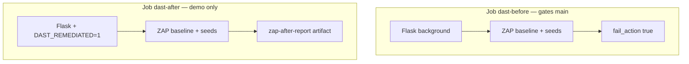

# Dynamic Application Security Testing — Phase 5

Runtime security testing with **OWASP ZAP baseline** against a Flask app started ephemerally in GitHub Actions. Complements Phase 2 SAST ([SECURITY.md](SECURITY.md)), Phase 3 secrets ([SECRETS.md](SECRETS.md)), and Phase 4 SCA ([SCA.md](SCA.md)).

**Pipeline status on `main`:** DAST workflow is expected to **FAIL** on the `dast-before` job (deliberate vulns). The `dast-after` job demonstrates V11 remediation with fewer alerts.

**Do not deploy this application publicly.** CI-only scanning keeps vulns ephemeral.

---

## Why DAST is not SAST, SCA, or secrets scanning

| Layer | Scans | This repo |
|-------|-------|-----------|
| **SAST** | Source code patterns | Bandit + Semgrep |
| **Secrets** | Credentials in git | Gitleaks |
| **SCA** | Known CVEs in dependencies | pip-audit + Dependabot |
| **DAST** | **Live HTTP behavior** | **OWASP ZAP baseline** |

DAST answers: *"When the app is running, can an attacker exploit these endpoints?"*  
SAST answers: *"Does the code use dangerous APIs?"*  
Neither replaces the other.

---

## Pipeline overview

Workflow: [`.github/workflows/dast.yml`](.github/workflows/dast.yml)



| Job | App mode | `fail_action` | Artifact |
|-----|----------|---------------|----------|
| `dast-before` | Full vulns (default) | `true` | `zap-before-report` |
| `dast-after` | `DAST_REMEDIATED=1` fixes V11 | `false` | `zap-after-report` |

Seed URLs: [`dast/zap-seeds.txt`](dast/zap-seeds.txt) — rendered as HTML links at `GET /dast-sitemap` for ZAP spider discovery (ZAP baseline has no URL-list flag; `-l` is alert level only).

---

## What ZAP catches in this repo

| Planted bug | Endpoint | SAST on main | DAST expectation |
|-------------|----------|--------------|------------------|
| **V11** open redirect | `/login/redirect?next=` | Gap | **High** — ZAP rule 10028 |
| **V09** reflected XSS | `/search/render?q=` | WARNING only | **Likely** |
| **V04** secret leak | `/admin/debug` | Gap at CI thresholds | **Possible** — sensitive data in response |
| **V07** IDOR | `/orders/1`, `/orders/2` | Blind spot | **Possible** |
| V01/V02 SQLi, V08 SSRF, V03/V10 POST | various | Partial | **Weak** in baseline — needs active scan / POST fuzzing |

Interview point: DAST finds **runtime** issues SAST misses (V11, sometimes V09); SAST still wins on POST/JSON injection paths ZAP baseline never reaches.

---

## Local reproduction

```bash
uv sync
uv run flask --app webshop:create_app run --host 127.0.0.1 --port 5000 &
./scripts/wait-for-health.sh

# ZAP baseline via Docker (spider starts at /dast-sitemap, follows seed links)
docker run --rm --network host -v "$PWD:/zap/wrk:rw" ghcr.io/zaproxy/zaproxy:stable \
  zap-baseline.py -t http://127.0.0.1:5000/dast-sitemap -j -r dast-report.html
```

Compare remediated mode:

```bash
DAST_REMEDIATED=1 uv run flask --app webshop:create_app run --host 127.0.0.1 --port 5000 &
./scripts/wait-for-health.sh
docker run --rm --network host -v "$PWD:/zap/wrk:rw" ghcr.io/zaproxy/zaproxy:stable \
  zap-baseline.py -t http://127.0.0.1:5000/dast-sitemap -j -r dast-report-after.html
```

---

## Featured finding — V11 open redirect

**ZAP rule:** 10028 — Open Redirect  
**Endpoint:** `GET /login/redirect?next=`  
**Planted in:** [`src/webshop/routes/auth.py`](src/webshop/routes/auth.py)

### What it is

The app redirects to any URL in the `next` query parameter with no validation. Attackers use this for phishing: `https://yoursite.com/login/redirect?next=https://evil.com` looks trustworthy because the domain is yours.

### Exploit sketch (demo only)

```bash
curl -I "http://127.0.0.1:5000/login/redirect?next=https://evil.example"
# HTTP/1.1 302 Found
# Location: https://evil.example
```

### Fix (demonstrated in `dast-after` job)

Same-origin allowlist — only relative paths starting with `/`:

```python
parsed = urlparse(next_url)
if parsed.netloc or not next_url.startswith("/"):
    next_url = "/"
return redirect(next_url)
```

On `main`, this fix is gated behind `DAST_REMEDIATED=1` so local dev and SAST demos keep V11 intact.

---

## Before/after diff (expected)

Download both artifacts from one GitHub Actions run → **Artifacts**:

| Alert type | `zap-before-report` | `zap-after-report` |
|------------|---------------------|---------------------|
| Open Redirect (V11) | Present | **Absent** |
| Reflected XSS (V09) | Likely present | Likely still present |
| Missing security headers | Likely present | Likely still present |

Partial remediation is intentional — real fixes are rolled out incrementally; DAST verifies each change.

---

## Why CI-only (not Render / Fly.io)

This app contains **intentional** vulnerabilities (V01–V14). A public staging URL would expose SQLi, SSRF, and command injection to the internet. CI spins the app up for minutes on `127.0.0.1`, runs ZAP, uploads reports, and tears down — no persistent attack surface.

Render/Fly.io are valid for production apps with real staging environments; they are out of scope for this teaching repo.

---

## Blind spots / interview talking points

| Topic | Limitation |
|-------|------------|
| **Baseline vs active scan** | Baseline is passive + light spider; won't deeply fuzz POST JSON bodies |
| **API coverage** | Seed file required; OpenAPI import would improve coverage |
| **Auth flows** | No ZAP authentication context — can't test post-login IDOR well |
| **Flaky scans** | SSRF preview may hang on external URLs; seeds use `example.com` to limit risk |
| **Not a merge gate for everything** | `dast-after` is informational; only `dast-before` gates `main` |

---

## Related docs

- [SECURITY.md](SECURITY.md) — SAST findings, V07/V11 blind spots
- [NOTES.md](NOTES.md) — pattern vs taint; IDOR needs DAST or integration tests
- [SCA.md](SCA.md) — dependency CVEs
- [SECRETS.md](SECRETS.md) — secrets in git
