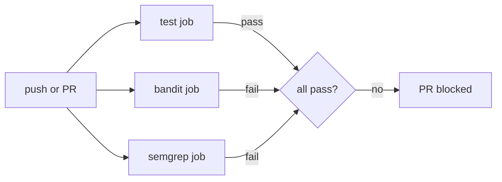

# Security Analysis — SAST-Gated Flask API

## Executive summary

This repository is an **intentionally vulnerable** Flask webshop API built for DevSecOps portfolio work. Phase 2 adds a GitHub Actions pipeline that runs **Bandit** and **Semgrep** on every push and pull request.

**The pipeline is expected to fail on `main`.** That is by design: it proves severity-based SAST gating works. Fourteen vulnerabilities (`V01`–`V14`) are planted in source code and marked with `# VULN:` comments. No baselines, `# nosec` suppressions, or allowlists are used.

For the **pattern match vs taint tracking** interview narrative (V13/V14 paired demos), see **[NOTES.md](NOTES.md)**.

Do not deploy this application publicly.

---

## Pipeline overview

Workflow: [`.github/workflows/sast.yml`](.github/workflows/sast.yml)

| Job | Tool | Gate threshold | Expected result |
|-----|------|----------------|-----------------|
| `test` | pytest | All tests pass | Pass |
| `bandit` | Bandit 1.9.x | `-ll -ii` (Medium+ severity, Medium+ confidence) | **Fail** |
| `semgrep` | Semgrep OSS | `--severity ERROR --error` | **Fail** |

Three jobs run in parallel. A PR is mergeable only when all three pass — which will not happen on the vulnerable `main` branch.



### Local reproduction

```bash
uv sync --dev

# Bandit (same flags as CI)
uv run bandit -r src/webshop -ll -ii

# Semgrep (same flags as CI)
uv run semgrep scan \
  --config p/python \
  --config p/flask \
  --config p/security-audit \
  --config p/secrets \
  --config .semgrep/ \
  --severity ERROR \
  --error \
  src/webshop

# Broader Semgrep scan (includes WARNING-level rules)
uv run semgrep scan \
  --config p/python \
  --config p/flask \
  --config p/security-audit \
  --config p/secrets \
  --config .semgrep/ \
  src/webshop
```

---

## Tool choice rationale

### Why Semgrep + Bandit?

| Tool | Role | Why here |
|------|------|----------|
| **Bandit** | Python AST analyzer | Catches Python-native sinks: `eval`, `pickle.loads`, `subprocess shell=True`, `verify=False`, weak MD5 — with low setup cost |
| **Semgrep** | Pattern-based + taint rules | SQLi/SSRF taint, XSS, command injection; custom taint rule for V14 — rulesets (`p/python`, `p/flask`, `p/security-audit`, `p/secrets`, `.semgrep/`) |

Together they provide complementary coverage without a SaaS account or enterprise license.

### Alternatives considered

| Tool | Why not primary here |
|------|----------------------|
| **CodeQL** | Excellent for GitHub-native SARIF and deep taint analysis; heavier setup; rules less approachable for a portfolio demo |
| **SonarCloud** | Strong dashboards and quality gates; requires SaaS account; less transparent in raw YAML |
| **Snyk Code** | Good IDE integration; blurs SAST/SCA; account required |
| **pip-audit / Gitleaks** | Complementary (SCA / secrets-in-git), not source SAST — good Phase 3 additions |

---

## Pattern match vs taint (V13 / V14)

| ID | Style | Bandit (CI) | Semgrep (CI) | Notes |
|----|-------|-------------|--------------|-------|
| **V13** | Direct pattern — `eval(request input)` one line | **B307** | `eval-injection`, `eval-detected` | Both tools agree; pattern suffices |
| **V14** | Multi-hop taint — `request` → helpers → `subprocess.run(..., shell=False)` | — (B603 is LOW, filtered) | **`flask-tainted-subprocess-no-shell`** (custom) | Taint + custom rule required |
| **V05** | Multi-hop but `shell=True` on sink | **B602** | `subprocess-shell-true` | Looks like taint demo; both use pattern on sink |

Full write-up: **[NOTES.md](NOTES.md)**

---

## Findings table (local scan, 2026-07-06)

Maps planted vulnerabilities to what each tool actually reported.

| ID | Vulnerability | OWASP | File | Bandit rule | Semgrep rule (ERROR gate) | Detected? |
|----|---------------|-------|------|-------------|---------------------------|-----------|
| V01 | SQL injection (search) | A03 Injection | `routes/products.py:25` | B608 (LOW confidence — filtered by `-ii`) | `python.flask.security.injection.tainted-sql-string` | Semgrep only (CI) |
| V02 | SQL injection (by id) | A03 Injection | `routes/products.py:35` | B608 (LOW confidence — filtered by `-ii`) | Not at ERROR severity | **Gap** |
| V03 | `eval()` on user input | A03 Injection | `routes/pricing.py:19` | **B307** | `python.lang.security.audit.eval-detected` (WARNING only) | Bandit only (CI) |
| V04 | Hardcoded secrets | A02 / A05 | `config.py:6-9` | B105 (LOW severity — filtered by `-ll`) | `p/secrets` (not ERROR on scan) | **Gap at CI thresholds** |
| V05 | Command injection (`shell=True`) | A03 Injection | `routes/admin.py:33` | **B602** | `python.lang.security.audit.subprocess-shell-true` | Both |
| V06 | Path traversal | A01 Broken Access Control | `routes/admin.py:48` | Not detected | Not at ERROR severity | **Gap** |
| V07 | IDOR (no authz check) | A01 Broken Access Control | `routes/orders.py:12` | Not detected | Not detected | **SAST blind spot** |
| V08 | SSRF + `verify=False` | A10 SSRF | `routes/products.py:50` | **B501** | `ssrf-injection-requests`, `ssrf-requests`, `disabled-cert-validation` | Both |
| V09 | Reflected XSS | A03 Injection | `routes/products.py:66` | Not detected | `raw-html-format` (WARNING only) | **Gap at ERROR gate** |
| V10 | `pickle.loads()` | A08 Integrity | `routes/auth.py:23` | **B301** | `avoid-pickle` (WARNING only) | Bandit only (CI) |
| V11 | Open redirect | A01 Broken Access Control | `routes/auth.py:35` | Not detected | Not detected | **Gap** |
| V12 | MD5 password hash | A02 Crypto Failures | `routes/auth.py:49` | **B324** | `insecure-hash-algorithm-md5` (WARNING only) | Bandit only (CI) |
| V13 | One-line `eval(input)` | A03 Injection | `routes/pricing.py:28` | **B307** | `eval-injection`, `eval-detected` | Both |
| V14 | Multi-hop subprocess (no shell) | A03 Injection | `routes/admin.py:61` | — (B603 LOW) | `flask-tainted-subprocess-no-shell` | Semgrep only (CI) |

### Bandit findings at CI threshold (`-ll -ii`)

| Rule | Severity | Location | Maps to |
|------|----------|----------|---------|
| B602 | High | `routes/admin.py:33` | V05 |
| B301 | Medium | `routes/auth.py:23` | V10 |
| B324 | High | `routes/auth.py:49` | V12 |
| B307 | Medium | `routes/pricing.py:19` | V03 |
| B307 | Medium | `routes/pricing.py:28` | V13 |
| B501 | High | `routes/products.py:50` | V08 |

### Semgrep findings at CI threshold (`--severity ERROR`)

| Rule | Location | Maps to |
|------|----------|---------|
| `subprocess-shell-true` | `routes/admin.py:33` | V05 |
| `tainted-sql-string` | `routes/products.py:25` | V01 |
| `ssrf-injection-requests` | `routes/products.py:45-50` | V08 |
| `ssrf-requests` | `routes/products.py:50` | V08 |
| `disabled-cert-validation` | `routes/products.py:50` | V08 |
| `eval-injection` | `routes/pricing.py:28` | V13 |
| `flask-tainted-subprocess-no-shell` | `routes/admin.py:61` | V14 |

---

## SAST blind spots

These planted bugs are **not reliably caught** by the current CI configuration. This is an important interview talking point: SAST is necessary but not sufficient.

| ID | Why SAST misses it | What to add |
|----|-------------------|-------------|
| V02 | Second SQLi pattern not tainted-tracked at ERROR severity | Lower Semgrep severity gate, custom rule, or CodeQL |
| V04 | Bandit rates B105 as LOW; Semgrep secrets rules did not ERROR | Gitleaks, `detect-secrets`, or Bandit `-l` |
| V06 | Path traversal needs path-concatenation rule at ERROR | Custom Semgrep rule for `Path / user_input` |
| V07 | IDOR is missing authorization logic — not a code pattern | Manual review, integration tests, DAST |
| V09 | XSS rules fire at WARNING, not ERROR | Add `--severity WARNING` gate or custom rule |
| V11 | Open redirect not matched by default rulesets | Custom Semgrep rule for `redirect(request.args` |
| V14 | Stock rules miss multi-hop subprocess without `shell=True` | Custom taint rule in `.semgrep/tainted-subprocess.yml` (now in CI) |

**Recommendation for production:** layer SAST with DAST (OWASP ZAP), dependency scanning (pip-audit), secrets scanning (Gitleaks), and periodic manual threat modeling.

---

## Remediation at scale

How each vulnerability class should be fixed in a real codebase:

| ID | Fix | Production pattern |
|----|-----|-------------------|
| V01, V02 | Parameterized queries | `cursor.execute("... WHERE id = ?", (product_id,))` |
| V03 | Remove `eval` | `ast.literal_eval` for literals only, or a safe expression parser |
| V04 | Externalize secrets | AWS Secrets Manager, Vault, or CI-injected env vars |
| V05 | No shell | `subprocess.run(["echo", "reindexing", index_name], shell=False)` |
| V06 | Canonicalize paths | `Path.resolve()` + verify `resolved.is_relative_to(base_dir)` |
| V07 | Authorization middleware | `@require_order_owner` decorator checking `session.user_id` |
| V08 | URL allowlist + TLS | Validate scheme/host against allowlist; never `verify=False` |
| V09 | Output encoding | Jinja2 autoescape, or `html.escape()`; `Content-Type: application/json` for APIs |
| V10 | Safe serialization | JSON or signed tokens (JWT); never `pickle` on untrusted input |
| V11 | Same-origin redirects | Allowlist paths: `if not next_url.startswith("/"): raise` |
| V12 | Strong hashing | `bcrypt` or `argon2` via `werkzeug.security` |
| V13, V03 | Remove `eval` | Safe math parser or pre-defined discount table |
| V14 | Validated argv, no user-influenced args | Fixed command template; pass user data via stdin or env after validation |

---

## What I'd do differently in production

1. **Tiered gating** — block on CRITICAL/HIGH, warn on MEDIUM (with SLA to fix), track in Jira/Linear
2. **Baselines for legacy debt** — `semgrep ci` with known-findings baseline so only *new* issues block merges
3. **Shift-left** — pre-commit hooks running Bandit + Semgrep locally before push
4. **SARIF upload** — publish results to GitHub Security tab for centralized triage
5. **Custom rules** — org-specific Semgrep rules for IDOR patterns, open redirects, and internal API conventions
6. **Policy management** — Semgrep AppSec Platform or similar for rule rollout across repos

---

## Future work

- **`remediated` branch** — fix all V01–V12, demonstrate green pipeline
- **pip-audit job** — dependency CVE scanning (SCA, not SAST)
- **Gitleaks job** — catch V04 secrets in git history
- **DAST with OWASP ZAP** — catch V07 IDOR and runtime XSS
